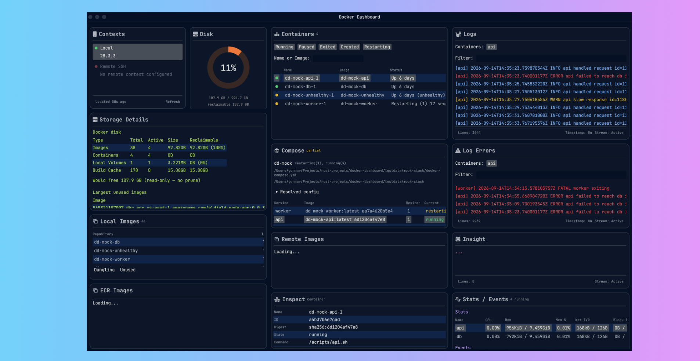

# Docker Dashboard


[](LICENSE)
[](https://github.com/GunnarKarlsson/docker-dashboard/stargazers)

-- WORK IN PROGRESS --

A Dashboard written in Rust using egui for viewing Docker hosts, containers, images, and Compose data in a single window.



## Run

```bash
cargo run -p docker-terminal
```

Requires Rust 1.88+ (see `rust-toolchain.toml`) and, for live data in later steps, Docker on `PATH`.

## Mock stack

The project includes mock docker compose services for the purpose of quickly testing new features in development. These services are based on Alpine: `api`, `worker`, `db`, `unhealthy` to trigger difference features on the dashboard during development. `db` writes into a named volume. `unused` is built but not started so Storage Details has an unused image.

How to build and run the mock docker compose services:
```bash
docker compose -f testdata/mock-stack/docker-compose.yml --profile disk build unused
docker compose -f testdata/mock-stack/docker-compose.yml up -d --build
```

Tear down with `docker compose -f testdata/mock-stack/docker-compose.yml down -v`. The API is published on `localhost:18080`.

## AI insights

The dashboard submits a clustered Log Errors snapshot to a Chat Completions API and shows the reply in the **Insight** panel.

Error lines are grouped by container name and message shape. Numbers, paths, and hex are collapsed so the same crash fingerprints together. Secrets (Bearer tokens, emails, MACs, JWT-like blobs) are redacted before the POST.

When the mix of errors changes, the app posts again, with a cooldown. No request is sent until `AI_PROVIDER_API_KEY` is set.

The model replies with a one-line verdict (`HEALTHY` / `DEGRADING` / `FAILING`), top issues, and a recommendation for what to do next.

### Configure AI provider

Settings are read from the process environment. On startup the app also loads `crates/docker-terminal/.env` if that file exists.

| Variable | Required | Default |
| --- | --- | --- |
| `AI_PROVIDER_API_KEY` | yes | (empty — Insight is skipped) |
| `AI_PROVIDER_BASE_URL` | no | `https://api.deepseek.com` |
| `AI_PROVIDER_MODEL` | no | `deepseek-v4-pro` |

Example `.env`:

```
AI_PROVIDER_API_KEY=sk-...
AI_PROVIDER_BASE_URL=https://api.deepseek.com
AI_PROVIDER_MODEL=deepseek-v4-pro
```

The provider should accept [OpenAI Chat Completions](https://platform.openai.com/docs/api-reference/chat/create): `POST {AI_PROVIDER_BASE_URL}/chat/completions` (include `/v1` in the base URL if that is part of the path).

## Commands used by the app

Every Docker subprocess uses `docker` on `PATH`. 
Pollers retry with +1s backoff after a failed command, capped at 5s. The app does not start, stop, prune, or otherwise mutate Docker state.

### Startup

| Command | When |
| --- | --- |
| `docker version` | Availability check on launch |
| `docker compose version` | Availability check on launch |
| `docker version --format '{{json .}}'` | Contexts panel, then heartbeat |

### While a context is selected

Selecting Local starts pollers plus one `docker logs -f` process per running or restarting container. Logs and Log Errors each follow the same containers separately.

Streaming (until the context is deselected or the container is replaced):

- `docker logs --tail 200 -f --timestamps <container-id>`

| Command | Interval | Used for |
| --- | --- | --- |
| `docker version --format '{{json .}}'` | 5s | Heartbeat / engine version |
| `docker system df --format '{{json .}}'` | 10s | Disk donut |
| `docker system df -v --format '{{json .}}'` | 20s | Storage Details |
| `docker ps -a --format '{{json .}}'` | 2s | Containers |
| `docker images --format '{{json .}}'` | 10s | Local Images |
| `docker stats --no-stream --format '{{json .}}'` | 2s | Stats |
| `docker events --since 30m --until 0s --format '{{json .}}'` with filters `pull`, `create`, `start`, `die`, `oom`, `health_status`, `kill`, `destroy`, `restart` | 5s | Events |
| `docker inspect <id>` | 3s | Inspect (selected container or image) |
| `docker volume ls --format '{{json .}}'` | 10s | Volume list (feeds Storage Details) |
| `docker volume ls -f dangling=true --format '{{.Name}}'` | with volumes | Dangling flag |
| `docker volume inspect <names…>` | with volumes | Created-at overlay |
| `docker network ls --format '{{json .}}'` | 10s | Networks |
| `docker network inspect <ids…>` | with networks | Attachments overlay |
| `docker compose ls --format json` | 3s | Discover Compose project (prefers `dd-mock`) |
| `docker compose -f <file> ps -a --format json` | 3s | Compose services (`-p <project>` if no file) |
| `docker compose -f <file> config --services` | 3s | Resolved service names |
| `docker compose -f <file> images --format json` | 3s | Compose image tags |
| `docker inspect <compose-container-ids…>` | 3s | Restart counts / health for Compose |
| `sysctl -n hw.memsize`, `vm_stat`, `uptime`, `df -kP /` | 5s | Host RAM / load / root disk (macOS) |
| `cat /proc/meminfo`, `uptime`, `df -kP /` | 5s | Same, on Linux |

Closing the window kills each `docker logs -f` child and signals pollers to stop. A `docker` command already in flight is not killed; it finishes, then the process exits.

## Security

See [SECURITY.md](SECURITY.md) for how to report vulnerabilities privately.

## License

Copyright (c) 2026 Gunnar Karlsson. Licensed under the [MIT License](LICENSE).

The UI uses JetBrains Mono Nerd Font (SIL Open Font License) from `crates/docker-terminal/assets/fonts`. Panel icons include Font Awesome Free icons (CC BY 4.0).

